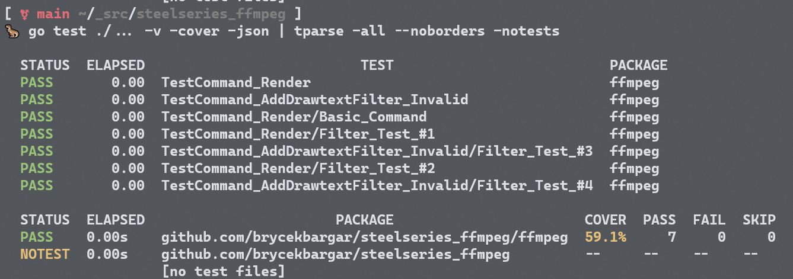

# Moments Text Effects API

An api endpoint for adding "Text Effects" to videos using ffmpeg drawtext filters. Completed as part of a technical interview.

### Running and calling the API

`go run main.go` in the root of the repository will start the basic server.
By default it is listening on localhost:4123.
You can check to make sure the server is up by making a GET request to `/`.

The api for text effects is POST `/api/texteffects` with the video and text effect information as json in the body of the request.
On a successful request the server will return 200 OK and log the ffmpeg string.
On a non-successful request the server will return a failure status code with the reason.

### Running the tests

The ffmpeg package has test cases for rendering the ffmpeg command as well as validating filters as they are added to the command.
You can run the tests using `go test`.
I like to use [tparse](https://github.com/mfridman/tparse) which can be invoked with:

```bash
go test ./... -v -cover -json | tparse -all --noborders -notests
```



Additionally, there is a postman collection in the root of the repository which contains an http request for each of the provide test cases.